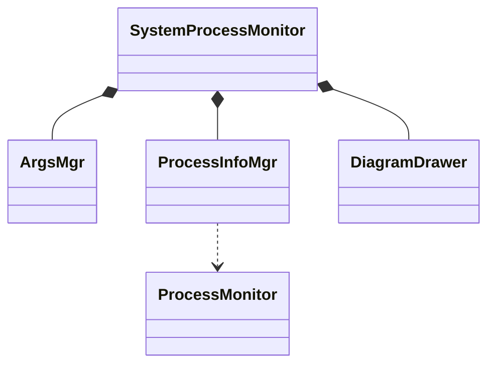
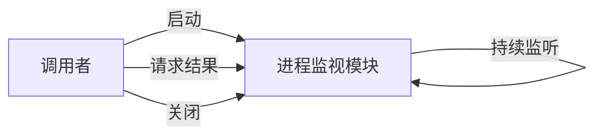
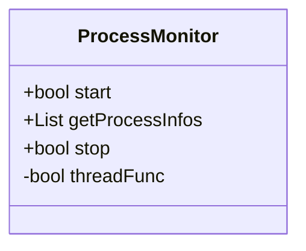

# 设计

敏捷项目管理中有一个概念叫做“拥抱变化”，它指出需求在各个阶段都有可能发生改变，变化可能来源于甲方，来源于环境，等等。因此，敏捷项目管理贯彻MVP（最小可交付单元）原则，让产品逐步迭代升级，最终达成甲方满意的效果。

于是我们当时举一反三，在设计阶段也开始考虑如何“拥抱变化”——分析大概率可能会出现的变动场景，例如甲方可能会要求指定一个进程监控。但是在一次培训中，一位讲师在介绍敏捷设计原则的时候提到“一开始设计时扩大范围性的考虑变化并不是真正的拥抱变化，而是在拒绝变化”。他的这个观点给了我很大启发，回顾此前设计阶段总是希望能更完善地设计，尽可能地考虑未来的变动场景，但这一定是好的么？

同样在那堂培训中讲师介绍了一个观点：“再一不再二”。也就是说，设计变动出现了一次，就需要考虑这部分重构，以迎接未来可能会发生的新的变化。这个观点实际上是将适应变化的时机从版本前移动到版本后，好处是在设计时不再需要耗费那么多头发去思考未来甲方的意向，坏处是首次响应变动的时间会变长。实话说，我觉得这个观点很有道理，但还需要根据实际情况应用，至少某种功能在未来可以预见上线的情况下是可以提前做一些适配性设计的。

那在这个项目中，我预计项目需要一个“指定特定进程监控”的需求——因为这个是我接下来一段时间需要的，它不一定服务于原本的甲方——这也是接下来设计时你可能会发现有一些奇奇怪怪的功能被添加进来了的原因。

## 模块设计

根据需求功能点，我们很容易就找到了该项目中都涵盖了那些模块：

1. 进程监视模块(ProcessMonitor)：负责捕获所有进程和资源占用，实际上就是`psutil`的再封装，但它只提供合并了所有子进程的结果。
2. 进程信息管理模块(ProcessInfoMgr)：负责将进程信息统计汇总。
3. 图表绘制模块(DiagramDrawer)：负责将汇总数据转换成图表。
4. 管理模块(SystemProcessMonitor)：负责将上述模块整合。
5. 参数模块(ArgsMgr)：负责接收用户输入控制台参数，并提供给进程。

于是我们就很容易地画出了模块图：TODO: 看看类图对不对

## 功能设计

我们已经知道大概都会有那些模块，并且每一个模块大概都有什么职责，那么接下来就是细化一下他们的功能。或者说，我们接下来就是细化模块的接口。

### 进程监视模块

进程监视模块它需要捕获所有进程和资源占用，因此它既可以是异步的，也可以是同步的。

如果它是异步的，那么它的形态大致是：`启动`模块后模块在子线程持续监听，并将统计信息缓存，当有人`请求结果`时便把当前缓存的统计信息返回。最终再`关闭`即可完成生命周期。

如果它是同步的，那么它的形态大致是：当调用者`请求当前进程资源快照`时，模块`启动`并连续多次监听，然后将结果返回。

那我们是选择异步的还是同步的方案呢？在决策之前，我们需要清楚影响决策的信息，或者可以称为决策的指标。

在这里，我们分析一下这个模块应具备的功能：

- 能够获取所有进程的ID以及资源信息

这里的功能十分简单，无论是异步的还是同步的都可以解决问题。但这两种方案也都存在一定的优劣：

|     | 优点                    | 缺点                                |
| --- | --------------------- | --------------------------------- |
| 异步  | - 可以快速请求和返回结果，效率高     | - 实现复杂：需要多线程，异常不易处理               |
| 同步  | - 实现简单，只需要单线程，异常很容易处理 | - 每次调用可能需要等待一段时间 - 性能瓶颈低，进程多时容易卡顿 |

二者实际上都有可取之处，如果只是简单的项目采取同步的方式稳妥且快速，是完成任务的不二之选。不过本教程自然不会选同步方案，否则怎么向大家展现知识点呢？

最终，我们得到进程监视模块应该具备以下功能接口：

### 进程信息管理模块

进程信息管理模块负责从进程监视模块中获取数据，然后对数据进行分析汇总。调用者`初始化`模块后便可以随时`获取汇总信息`。

## 时序设计
