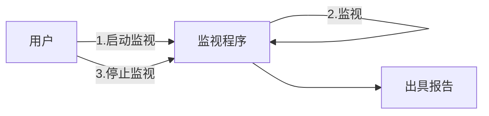

# 需求描述

> 做一个揪出偷跑的工具

这个需求是一个典型的“一句话需求”，这也是我们做项目时可能遇到的一个情况：甲方只知道他大概要什么东西，但对这个东西并没有一个清晰的认知。

那你如果是项目经理，恐怕内心骂娘的同时，也感谢了一下上苍，最起码甲方没有把一些他认为各种“有必要”的功能添加进来，就比如说他没有要求你在这个小工具上加上直播和打赏功能。

很多同学可能很疑惑为什么现在的软件逐渐变得复杂，一开始总是很轻巧很易用，但后来各种各样的“社交”、“商场”、“直播”功能如雨后春笋般加入，程序也迅速臃肿壮大。

对于极客的程序员来说这是一件不能理解且不能容忍的事情，因为我们更多从软件工程角度去思考产品，但事实上，了解过市场营销的同学可能会认为已经铺开的程序（一般此时程序还很简洁）是一个很不错的渠道，企业需要利用已有的渠道获得私域用户，同时企业可以通过这些成熟渠道横向拓展企业的业务范围——毕竟更新手机里的APP比重新下载安装一个不需要的APP更能让用户接受。

回到正题。

想必各位同学已经清楚软件工程的比较常见的几个阶段：需求、设计、编码、测试。无论你使用的是瀑布模型又或者其他，大体上是逃不出这几种阶段的，当然，特殊情况除外。

作为项目经理，在了解到甲方意向后，第一件事情就是：弄清楚他想要什么。

## 理清业务流程

不可否认的是，我们思考产品形态时思维如果没有锚点和枷锁就很容易发散出去，这里说的锚点指的便是业务流程，而这个枷锁则是从成本和收益的权衡考量。

TODO 图

我们来分析一下这个业务流程：

其中出具报告中应包含以下信息：

1. 监视期间启动和停止的程序：用于方便地查看哪些程序偷偷启动和关闭
2. 每个程序的CPU和内存占用情况：用于找到风扇狂转的罪魁祸首

以上部分就是本次需求核心业务流程，也可以称为业务的核心需求，这便是我们进行需求分析的锚点，以此为基础发散，但仍需在枷锁内收敛。

当我们接收到一个需求功能时，在不加限制的前提下，需求可以变得无限大，例如这个需求我可以做成跨平台的，有美观的UI界面，有极高的并发处理能力，有极大的拓展能力，甚至可以做插件商店等等等等，如果这些做出来想一想就觉得很酷。但事与愿违，我们没有时间，没有精力，没有金钱，没有能力去实现这个美好的梦想，此时，一个枷锁变得尤为重要，因为你可以在一开始就在枷锁的指导下缩小你的野心。

对于本次需求而言，最大的枷锁便是时间成本，因为只有周末且摸鱼时间段才有时间去完成本次需求。其次便是金钱成本，我并不打算在这个需求上投入除了电费以外的任何费用。

在逐步分析后，我们的需求被压缩到尽可能小，然后就可以以此为基础分析需求功能了。

## 需求功能

在理清楚主线业务流程后，我们就可以基于业务流程分析需求所包含的功能点。我们注意到业务流程具有三个“行为”，分别是`启动监视`，`监视`，`停止监视`，其中`启动监视`和`停止监视`是用户行为，`监视`理论上也同样属于`启动监视`行为的延伸。我们再根据行为分析功能点。

在这里我引入了`基础功能点`和`拓展功能点`两个概念。

其中`基础功能点`为满足功能的最小功能实现，它不一定是最优的，但一定是开发设计成本最低的，它不一定是最好用的，但一定是满足需求的。

而`拓展功能点`则不一样，它一般是产品经理基于用户体验、设计经验又或者已有框架的特点提供的更优方案。这不代表该方案一定比`基础功能点`成本更高，对用户而言属于满足基本需要之余的锦上添花。

| 行为 | 基础功能点 | 拓展功能点 |
|---|---|---|
|启动监视|用户命令输入|1.REST接口 2.WinForm界面|
|监视|记录所有进程资源占用信息|1.子进程与主进程合并统计 2.指定进程记录 3.指定记录频率|
||记录启动停止进程名单|1.记录启动停止时间点|
|停止监视|统计汇总记录|1.统计所有进程资源占用均值和峰值 2.统计启停进程活动时长|
||输出报告|1.图表展示 2.Excel导出|

当然，`拓展功能点`肯定不止上表中所列出的这些点，我这里只是为了举例提出了一些“可能”会被甲方和我同时接受的`拓展功能点`，虽然在这个需求里，我既是甲方又是乙方。

然后我们再对需求点进行取舍，挑出其中最想要的，作为我们接下来的开发目标：

| 行为 | 基础功能点 | 拓展功能点 |
|---|---|---|
|启动监视|①用户命令输入|~~1.REST接口~~ ~~2.WinForm界面~~|
|监视|②记录所有进程资源占用信息|③1.子进程与主进程合并统计 ④2.指定进程记录 ⑤3.指定记录频率|
||⑥记录启动停止进程名单|~~1.记录启动停止时间点~~|
|停止监视|⑦统计汇总记录|⑧1.统计所有进程资源占用均值和峰值 ~~2.统计启停进程活动时长~~ ⑨3.按照资源占用均值倒序排序|
||⑩输出报告|⑪1.图表展示 ~~2.Excel导出~~|

我们丢掉了一些不是特别重要的功能点，当然，`基础功能点`是一定要完成的，因此也都可以看得出只有`拓展功能点`被舍弃了部分。那剩余的部分就是需求的功能点了。

## 可行性分析

在分析好需求功能点后，我们需要动手来确认一下这个需求是否可行，因此我们需要在以下几个方面探索可行性：

1. 需要有一个可以获取所有系统进程的库；需要有一个可以获取指定进程资源占用的库。
2. 需要有一个可以生成图表的库。

有关可行性探索，如果有现成的轮子肯定会优先使用，如果没有或者一些特殊情况我们才会选择造轮子。

那对于功能点②，在查询相关的资料后，我们发现`psutil`这个库可以完美解决这两个问题，在试验完成之后，确认了功能可用。

:::tip [psutil](https://psutil.readthedocs.io/en/latest/)
psutil (process and system utilities) 是一个跨平台的库，用于在Python中检索运行中的进程和系统利用率（CPU、内存、磁盘、网络、传感器）的信息。它主要用于系统监控、剖析和限制进程资源以及运行进程的管理。它实现了经典UNIX命令行工具提供的许多功能，如ps、top、iotop、lsof、netstat、ifconfig、free等。 psutil目前支持以下平台：

- Linux
- Windows
- macOS
- FreeBSD, OpenBSD, NetBSD
- Sun Solaris
- AIX

支持的Python版本是2.7、3.4+和PyPy。
:::

对于功能点⑪，我们同样选择了`pyecharts`这个库来作为图表展示的工具。

:::tip [pyecharts](https://05x-docs.pyecharts.org/#/zh-cn/prepare)
Apache ECharts 是一个由百度开源的数据可视化，凭借着良好的交互性，精巧的图表设计，得到了众多开发者的认可。而 Python 是一门富有表达力的语言，很适合用于数据处理。当数据分析遇上数据可视化时，pyecharts 诞生了。
:::

在经过一系列的尝试后，我们终于得出结论：该需求方案可行。

## MVP

虽然需求已经确认，与甲方达成共识，确认上面的这些功能确实是甲方所需的，但这并不意味着我们一定要一次性交付整个项目。

MVP(Minimum Viable Product)，即“最小可行性产品”